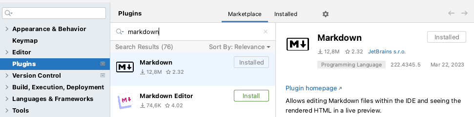
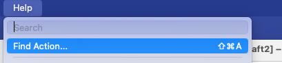
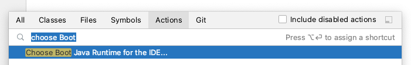
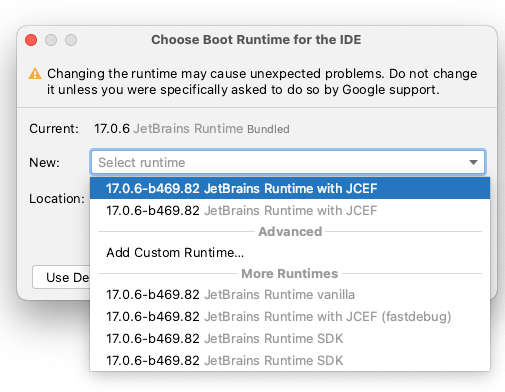
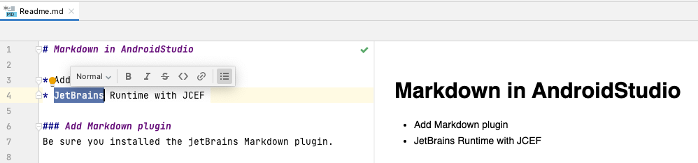

# Markdown in AndroidStudio

* Add Markdown plugin 
* JetBrains Runtime with JCEF 

### Add Markdown plugin 
Be sure you installed the jetBrains Markdown plugin. 

> Preferences -> Plugins -> Search for Markdown.

### JetBrains Runtime with JCEF

> Help -> Find Action.

> Search for `choose Boot`.

> New -> select `JetBrains Runtime with JCEF` -> Restart AndroidStudio.

Then you can use the markdown preview and floating toolbar in Android studio.

Reference
https://www.jetbrains.com/help/idea/markdown.html#preview